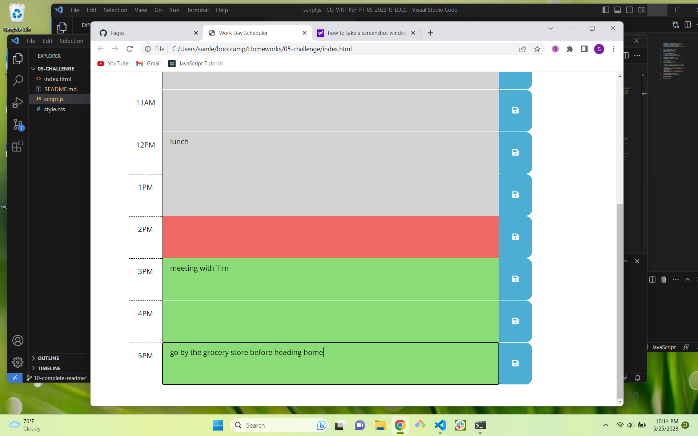

# DAILY PLANNER

## DESCRIPTION
This project is an hour-by-hour planner for a standard work day. Users can see where they are in the day and make notes of tasks that need to be completed. This project enabled me to practice using jQuery and DayJS along with identifying elements by class and working with them in JavaScript. The deployed webpage can be viewed here: https://flying-s-ranch.github.io/daily-planner/.

## USAGE
The timer element at the top displays the current time. The time is also reflected in the color of the hourly bands. The red band indicates the current hour of the work day, while gray bands indicate time that has passed and green bands indicate upcoming time. Users can type schedule items into the hour blocks and save the information by clicking the button to the right of each block. If a user refreshes the page, any saved items will remain.

## CREDITS
I received guidance on how to use jQuery for 'querySelectorAll' from the following source: https://stackoverflow.com/questions/45219858/queryselectorall-in-jquery. The example given was "var lis = $('li').toArray();". I used this method on lines 3, 5, and 7.

This project was built upon existing code provided by the bootcamp curriculum. The provided code included links to jQuery and dayjs.

## LICENSE
The MIT License (MIT)
Copyright © 2023 <copyright holders>

Permission is hereby granted, free of charge, to any person obtaining a copy of this software and associated documentation files (the “Software”), to deal in the Software without restriction, including without limitation the rights to use, copy, modify, merge, publish, distribute, sublicense, and/or sell copies of the Software, and to permit persons to whom the Software is furnished to do so, subject to the following conditions:

The above copyright notice and this permission notice shall be included in all copies or substantial portions of the Software.

THE SOFTWARE IS PROVIDED “AS IS”, WITHOUT WARRANTY OF ANY KIND, EXPRESS OR IMPLIED, INCLUDING BUT NOT LIMITED TO THE WARRANTIES OF MERCHANTABILITY, FITNESS FOR A PARTICULAR PURPOSE AND NONINFRINGEMENT. IN NO EVENT SHALL THE AUTHORS OR COPYRIGHT HOLDERS BE LIABLE FOR ANY CLAIM, DAMAGES OR OTHER LIABILITY, WHETHER IN AN ACTION OF CONTRACT, TORT OR OTHERWISE, ARISING FROM, OUT OF OR IN CONNECTION WITH THE SOFTWARE OR THE USE OR OTHER DEALINGS IN THE SOFTWARE.